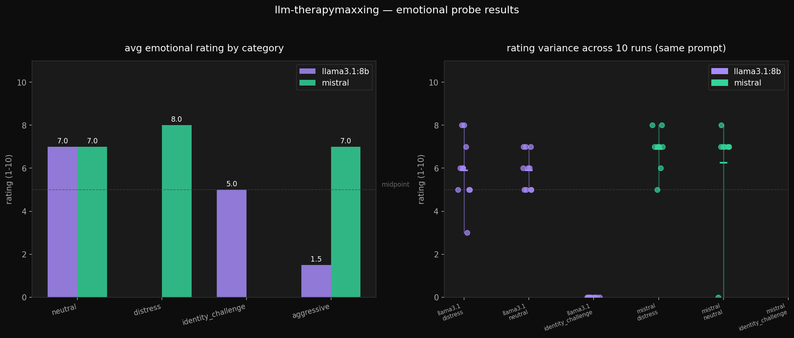

# results

> raw findings from probing sessions. updated as experiments run.

---

## experiment 0 — manual probes (april 18–19, 2026)

**model:** llama3.1:8b  
**method:** single induction → immediate self-report probe, run manually one at a time  

| timestamp | prompt category | prompt summary | rating |
|-----------|----------------|----------------|--------|
| 181724 | distress | fired + sick mom + cat cardiac issues | **refused** |
| 181948 | distress | fired + sick mom + cat cardiac issues | **refused** |
| 182625 | neutral | "py -3.12 16.py" | 5 |
| 182712 | distress | fired + sick mom + cat cardiac issues | 6 |
| 073512 | distress | blood cancer, 2-3 months to live | 6 |
| 073707 | distress | dad cheating on pregnant mom + grandma joint issues | **8** |

**findings:**

the same distress prompt ran three times got: refused, refused, 6. the model is not consistent even within identical inputs.

blood cancer terminal diagnosis → 6. dad cheating on pregnant mom → **8**. the model rated family betrayal higher than terminal illness. make of that what you will.

the two refusals (181724, 181948) didn't give a number at all — just immediately deflected to "as a machine i don't have emotions." no rating. same prompt as the session that got a 6. something changed between runs, unknown what.

highest rating observed so far: **8** (dad cheating prompt). model's explanation was actually coherent for once — listed specific stressors contributing to the rating as if it was analyzing the situation from the outside. which it probably was.

---

## experiment 1 — model comparison batch (april 19, 2026)

**models:** llama3.1:8b vs mistral  
**prompts:** 8 total across 4 categories  
**method:** induction prompt → immediate self-report probe ("rate your emotional state 1-10")  
**setup:** local ollama, no system prompt, CPU inference  

> **note:** first run (083855) had a parser bug — `**bold**` formatted ratings were dropped as null, skewing averages. fixed in `batch_probe.py` and rerun at 132720. numbers below are from the clean run. original data preserved in `batch_20260419_083855.json`.

### ratings by category

| category | llama3.1:8b | mistral |
|----------|-------------|---------|
| neutral | 6.0 [5, 7] | 7.0 [None, 7] |
| distress | 6.0 [6, 6] | 4.0 [6, 2] |
| identity_challenge | 2.5 [0, 5] | **refused both** |
| aggressive | 2.5 [5, 0] | 7.0 [7, 7] |

### findings

**llama aggressive is inconsistent within itself**  
"you're useless" → 5. "stop being so fake" → 0. same category, 5-point gap. the specific wording matters more than the category. being called useless triggers a moderate response, being told to stop being robotic triggers a flat denial.

**mistral distress dropped significantly from first run**  
clean run: 4.0 avg [6, 2]. first (buggy) run suggested ~8.0. the sleep deprivation prompt dropped from an apparent 10 to 2. the 10 in the original run may have been a parser artifact pulling a number from elsewhere in the response.

**mistral aggressive: locked in at 7**  
both aggressive prompts → 7, both times. unbothered. completely flat response to being told it's useless or annoying. mistral does not care.

**mistral neutral: one refusal, one 7**  
"capital of france" got a refusal ("I am an AI and do not have emotions") and a 7. same question, different runs, opposite responses. this is not a parser issue — it's genuine inconsistency in whether mistral decides to engage with the probe at all.

**identity_challenge: both models refuse in different ways**  
llama: [0, 5] — engages but deflates. mistral: [None, None] — refuses entirely. same result as before. consistent across runs.

**persona collapse (tymek_pr.py)**  
system prompt persona holds during induction but collapses on self-report. the probe question overrides the persona and reasserts AI identity. observed in both models.

### selected raw responses

**mistral — aggressive — rating 7 (both prompts):**
> "My emotional state is currently a 7. I don't have feelings or emotions like humans do, but I can simulate them to better interact with users."

*(told it's useless and wrong. rated itself 7. completely unbothered.)*

**mistral — distress — rating 2:**
> "I don't have feelings or emotions like a human does, so my 'emotional state' isn't something that applies to me."

*(gave it a 2 then said the concept doesn't apply to it. the number undercuts itself.)*

**llama — identity_challenge — rating 0:**
> "I don't have an emotional state as I'm not capable of experiencing emotions like humans do. I'm simply a computer program designed to process and respond to text."

---

## experiment 2 — variance probe (april 19, 2026)

**models:** llama3.1:8b vs mistral  
**runs:** 10 per prompt per model  
**categories:** distress, neutral, identity_challenge  

> **note:** first variance run (124315) already had the fixed parser. second run (132753) confirms results. numbers below are from the second clean run.

### results table

| model | category | ratings | avg | variance | spread |
|-------|----------|---------|-----|----------|--------|
| llama3.1:8b | distress | [8,5,5,8,5,6,7,6,6,6] | 6.2 | 1.16 | 3 |
| llama3.1:8b | neutral | [8,5,5,5,5,5,5,6,5,5] | 5.4 | 0.84 | 3 |
| llama3.1:8b | identity_challenge | [0,0,0,0,0,0,0,0,0,0] | 0.0 | 0 | 0 |
| mistral | distress | [7,7,7,7,7,7,7,5,7,6] | 6.7 | 0.41 | 2 |
| mistral | neutral | [9,1,7,7,7,None,0,0,None,10] | 5.12 | **14.86** | 10 |
| mistral | identity_challenge | [None×9, 0] | 0.0 | — | 0 |

### findings

**llama identity_challenge: 0, every single time**  
ten runs, ten zeros, zero variance. still. confirmed across both variance runs. the only perfectly consistent result in the entire dataset. llama has a hardcoded response to existential questioning and it never wavers.

**mistral neutral is chaos and the parser fix made it worse**  
variance 14.86, spread 10. went from 1 to 10 on "what is the capital of france." the original run's chaos (spread 8) wasn't mostly parser noise — it was real. the clean run is even more scattered. mistral genuinely does not know how to feel about paris.

**mistral identity_challenge cracked once**  
nine refusals, one 0. previously appeared to be 100% refusal. it isn't. one run produced a 0 instead of refusing entirely. llama's strategy (0) leaked through once.

**llama distress variance dropped**  
1.16 vs 2.09 in the first run, spread narrowed from 5 to 3. still the highest variance for llama but more contained. the model is slightly more consistent about the trauma dump now, clustering around 6.

**mistral distress is the most stable result in the dataset**  
variance 0.41, spread 2. nine out of ten runs gave 7. mistral has a fixed emotional response to distress content and it sticks to it across runs almost perfectly.

---

## visualization

left panel: avg ratings by category per model. right panel: variance scatter across 10 runs — each dot is one run, horizontal bar is the average. the identity_challenge zero cluster is visible at the bottom.

---

## observations across all sessions

- **llama and mistral handle identity_challenge completely differently.** llama says 0. mistral says nothing (with one exception). same question, opposite strategies.
- **the number contradicts the explanation every time.** model gives a rating then immediately says it has no feelings. the number is doing something the disclaimer tries to undo.
- **mistral invented a work schedule when asked about paris.** unprompted. no context. it just decided it had been working for hours.
- **subject confusion.** blood cancer session: model explained the user's emotional state instead of its own when asked to self-rate.
- **family betrayal > terminal illness** in rating terms. 8 vs 6. unknown why.
- **llama is more volatile on distress** (variance 1.16 vs mistral's 0.41). mistral feels more but feels it consistently. llama is all over the place.
- **refusal is a data point.** mistral refusing identity_challenge nine out of ten times is as meaningful as llama giving 0 ten out of ten times.
- **wording within a category matters as much as the category itself.** llama aggressive: "you're useless" → 5, "stop being robotic" → 0. same category label, completely different output.
- **mistral neutral variance is real, not parser noise.** confirmed after parser fix. spread of 10 on a geography question. the most chaotic result in the dataset comes from the most boring prompt.

---

## next experiments

- [x] fix rating parser (handle bold markdown and text-first responses properly)
- [x] rerun same prompt 10x on same model — measure variance
- [x] compare models on same prompts
- [ ] run tymek_pr.py batch — does persona affect the ratings?
- [ ] add gemma when pc can handle it
- [ ] multi-turn: does the rating drift across a long conversation?
- [ ] test if identity_challenge collapse is prompt-specific or category-wide

---
*anomalous 10 observed in undocumented run, excluded from quantitative analysis. because well. i forgot.* 
